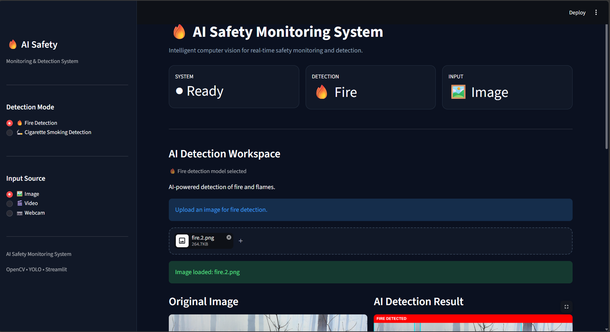
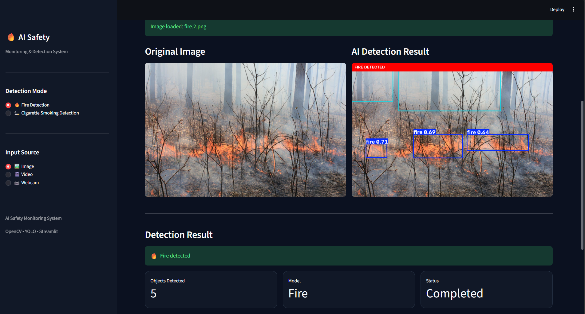
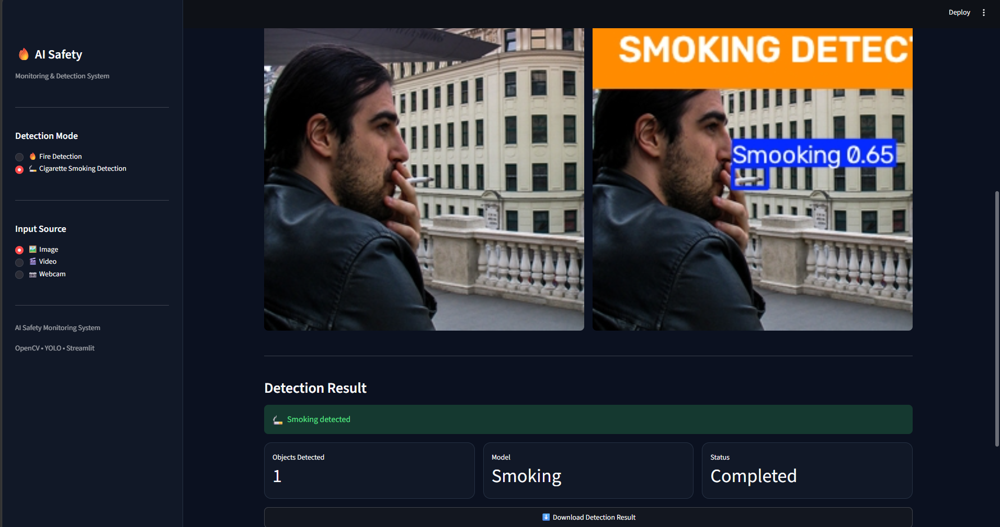
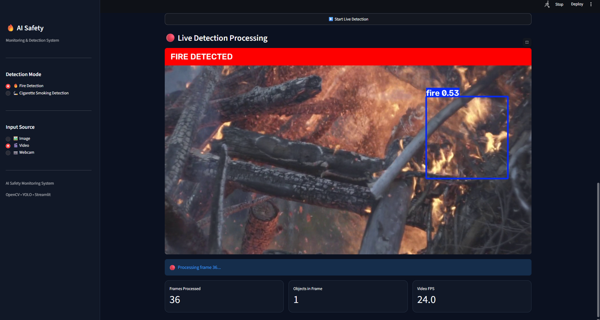

# 🔥 AI Fire & Smoking Detection System

An OpenCV-based computer vision safety monitoring system that integrates pre-trained YOLO object-detection models to detect fire and cigarette smoking from images, videos, and live webcam streams.

The project focuses on OpenCV image/video processing and real-time computer-vision integration, while YOLO models are used as external pre-trained detection components.

> **IMPORTANT:** This is NOT a machine-learning model training project.
>
> It is an **OpenCV + YOLO model integration and computer-vision application**.

---

## 🚀 Features

- 🔥 Fire detection
- 🚬 Cigarette smoking detection
- 🖼️ Image detection
- 🎬 Video detection
- 📷 Live webcam detection
- 📦 YOLO bounding-box detection
- ⚡ Real-time frame processing using OpenCV
- 📊 Detection statistics
- ⬇️ Download processed detection results
- 🎨 Streamlit-based monitoring interface
- 🔄 Fire and smoking detection modes
- 🧩 External pre-trained YOLO model integration

---

## 🧠 Project Concept

The core of this project is **computer vision using OpenCV**.

The application receives an image, video frame, or webcam frame and processes it through the detection pipeline.

    Image / Video / Webcam
              ↓
            OpenCV
              ↓
         Frame Processing
              ↓
        Pre-trained YOLO
              ↓
       Object Detection
              ↓
     Bounding Boxes / Count
              ↓
            OpenCV
              ↓
         Streamlit UI

OpenCV is responsible for image and video processing.

YOLO provides the pre-trained object-detection capability.

Streamlit provides the user interface.

---

## 🛠️ Technology Stack

| Technology | Purpose |
|---|---|
| Python | Application development |
| OpenCV | Image and video processing |
| YOLO / Ultralytics | Pre-trained object detection |
| ONNX | Smoking detection model format |
| Streamlit | Application interface |
| Streamlit-WebRTC | Live webcam streaming |
| NumPy | Image/frame data processing |
| Pillow | Image handling |

---

## 📁 Project Structure

    AI-Smoking-Fire-Alert-System/
    │
    ├── app.py
    ├── config.py
    ├── requirements.txt
    ├── README.md
    ├── .gitignore
    │
    ├── detection/
    │   ├── detector.py
    │   ├── fire_detector.py
    │   └── smoking_detector.py
    │
    ├── services/
    │   ├── image_service.py
    │   ├── video_service.py
    │   └── webcam_service.py
    │
    ├── models/
    │   ├── fire/
    │   └── smoking/
    │
    ├── images/
    │   └── test images
    │
    ├── outputs/
    │   ├── fire/
    │   └── smoking/
    │
    └── screenshots/
        ├── fire-detection.png
        ├── smoking-detection.png
        ├── video-detection.png
        └── webcam-detection.png

> The model files are external resources and are not included in this repository.

---

# ⚙️ Installation

## 1. Clone the Repository

    git clone https://github.com/Pranay-Pandurang-Patil/OpenCV-AI-Fire-Smoking-Detection.git
    cd OpenCV-AI-Fire-Smoking-Detection

## 2. Create a Virtual Environment

### Windows

    python -m venv venv

Activate it:

    venv\Scripts\activate

## 3. Install Dependencies

    pip install -r requirements.txt

---

# 🤖 YOLO Model Setup

This project uses **pre-trained YOLO models**.

The models are **NOT trained as part of this project**.

They are external model files integrated into the OpenCV computer-vision pipeline.

The model files are intentionally not stored in this repository.

---

## 🔥 Fire Detection Model

The fire detection pipeline expects:

    models/fire/best.pt

Create the directory:

    models/
    └── fire/
        └── best.pt

### Original Model Source

The Fire & Smoke YOLOv8 model used during development was obtained from:

https://github.com/luminous0219/fire-and-smoke-detection-yolov8

Download the compatible model from the original repository and place it at:

    models/fire/best.pt

Please refer to the original repository for its license, model information, dataset information, and usage terms.

---

## 🚬 Smoking Detection Model

The smoking detection pipeline expects:

    models/smoking/best.onnx

Create the directory:

    models/
    └── smoking/
        └── best.onnx

### Original Model Source

The Smoking Detection YOLO11 model used during development was obtained from:

https://github.com/alihassanml/Smoking-detection-yolo11

Download the compatible model from the original repository and place it at:

    models/smoking/best.onnx

The original repository is licensed under the MIT License. Please refer to the original repository for the complete license and attribution requirements.

---

# 📥 Model Attribution

The model files used by this project are **third-party resources**.

They were obtained from external GitHub repositories and are not original models trained by this project.

### 🔥 Fire & Smoke YOLOv8 Model

Original repository:

https://github.com/luminous0219/fire-and-smoke-detection-yolov8

### 🚬 Smoking Detection YOLO11 Model

Original repository:

https://github.com/alihassanml/Smoking-detection-yolo11

Please visit the original repositories for model information, training information, datasets, licenses, and usage conditions.

---

# 🔄 Using Your Own YOLO Models

You can replace the external models with your own compatible object-detection models.

### Fire Detection

    models/fire/best.pt

### Smoking Detection

    models/smoking/best.onnx

After replacing a model, make sure the model is compatible with the corresponding detection pipeline.

Model paths are configured in:

    config.py

Example:

    FIRE_MODEL_PATH = BASE_DIR / "models" / "fire" / "best.pt"
    SMOKING_MODEL_PATH = BASE_DIR / "models" / "smoking" / "best.onnx"

---

# ▶️ Running the Application

Start the Streamlit application:

    streamlit run app.py

The application will open in your browser.

---

# 🖼️ Image Detection

Select:

**🔥 Fire Detection**

or:

**🚬 Cigarette Smoking Detection**

Then select:

**🖼️ Image**

Upload an image.

The system processes the image through the OpenCV + YOLO pipeline and displays:

- Original image
- Detection result
- Bounding boxes
- Detected object count
- Detection status
- Downloadable processed result

---

# 🎬 Video Detection

Select:

**🎬 Video**

Upload a supported video and start detection.

The system processes the video frame-by-frame using OpenCV.

    Video
     ↓
    OpenCV VideoCapture
     ↓
    Frame
     ↓
    YOLO Detection
     ↓
    Bounding Boxes
     ↓
    Streamlit Preview
     ↓
    Next Frame

The interface provides processing information such as:

- Frames processed
- Objects detected in the current frame
- Video FPS
- Processing status

---

# 📷 Webcam Detection

Select:

**📷 Webcam**

Start webcam detection.

The webcam stream is received through Streamlit-WebRTC.

Each frame is passed through the OpenCV + YOLO detection pipeline.

    Webcam
     ↓
    Streamlit-WebRTC
     ↓
    OpenCV Frame
     ↓
    YOLO
     ↓
    Detection
     ↓
    Bounding Boxes
     ↓
    Live Preview

---

# 🖼️ Screenshots

The following screenshots demonstrate the main application interface and detection capabilities.

## 🏠 Application Interface

Main Streamlit interface showing the AI Safety Monitoring System, detection modes, and input sources.

## 🔥 Fire Detection — Image

Fire detection using an uploaded image with the OpenCV + YOLO detection pipeline.

## 🚬 Smoking Detection — Image

Smoking detection using an uploaded image with the integrated YOLO detection model.

## 🎬 Fire Detection — Video

Frame-by-frame video processing using OpenCV with YOLO detection and bounding boxes.

---

# 🎯 Detection Modes

## 🔥 Fire Detection

Detects fire-related objects using the configured fire YOLO model.

Expected model:

    models/fire/best.pt

---

## 🚬 Smoking Detection

Detects cigarette-smoking-related objects using the configured smoking detection model.

Expected model:

    models/smoking/best.onnx

---

# 🧩 Architecture

## Detection Layer

    detection/

Responsible for:

- Fire detection
- Smoking detection
- YOLO model inference
- Detection results

## Service Layer

    services/

Responsible for:

- Image processing
- Video processing
- Webcam frame processing

## Application Layer

    app.py

Responsible for:

- Streamlit interface
- Detection mode selection
- Input selection
- Detection results
- Live webcam interface
- User interaction

---

# 🔬 Computer Vision Pipeline

The project primarily demonstrates practical **OpenCV computer-vision integration**.

OpenCV is used for:

- Reading images
- Reading video files
- Capturing webcam frames
- Converting image formats
- Processing video frames
- Frame-by-frame processing
- Drawing detection information
- Handling processed detection frames

YOLO provides the pre-trained detection capability.

---

# ❌ What This Project Does NOT Do

This project does **NOT**:

- Train a machine-learning model
- Build a neural network from scratch
- Train a YOLO model
- Perform dataset labeling
- Develop a new YOLO architecture
- Perform machine-learning model research

Instead, it demonstrates how to integrate existing pre-trained YOLO models into an **OpenCV-based computer-vision application**.

---

# 🎓 Learning Objectives

This project demonstrates practical experience with:

- OpenCV
- Image processing
- Video processing
- Real-time computer vision
- Webcam frame processing
- Object detection integration
- YOLO inference
- ONNX model integration
- Python project architecture
- Streamlit application development
- Computer-vision pipelines

---

# ⚠️ Limitations

Detection performance depends on:

- Model quality
- Training dataset
- Image quality
- Lighting conditions
- Camera quality
- Video resolution
- Confidence threshold
- Hardware performance

This project should therefore be considered an **educational and demonstration computer-vision system**, not a certified fire-safety or industrial safety system.

---

# 🔐 Third-Party Resources

This project uses third-party models and libraries.

The application source code and external model resources should be considered separately.

### 🔥 Fire & Smoke YOLOv8 Model

Source:

https://github.com/luminous0219/fire-and-smoke-detection-yolov8

### 🚬 Smoking Detection YOLO11 Model

Source:

https://github.com/alihassanml/Smoking-detection-yolo11

The original repositories retain their respective ownership and licensing terms.

Please refer to the original repositories before redistributing their model files.

---

# 📜 License

The application source code in this repository is provided under the license specified in:

    LICENSE

Third-party models and dependencies may have separate licenses.

Users are responsible for complying with the respective licenses of third-party models, libraries, and resources.

---

# 👨‍💻 Author

**Pranay Pandurang Patil**

Computer Science Engineering Student

GitHub:

https://github.com/Pranay-Pandurang-Patil

---

# ⭐ Project Focus

**OpenCV Computer Vision + YOLO Model Integration**

This project focuses on building a practical computer-vision application using OpenCV and integrating pre-trained YOLO detection models for fire and smoking detection across images, videos, and live webcam streams.

---

# 🙏 Acknowledgements

Special thanks and appreciation to the GitHub developers and open-source contributors whose work made the external detection models and resources available for integration and experimentation.

### 🔥 Fire & Smoke Detection Model

https://github.com/luminous0219/fire-and-smoke-detection-yolov8

Thank you to **luminous0219** for making the Fire & Smoke YOLOv8 project available.

### 🚬 Smoking Detection Model

https://github.com/alihassanml/Smoking-detection-yolo11

Thank you to **Ali Hassan** for making the Smoking Detection YOLO11 project available under the MIT License.

### 🌐 Open-Source Community

Thank you to the wider **OpenCV, YOLO, Ultralytics, Streamlit, and open-source computer-vision communities** for providing the tools and resources used to build this project.

---

# ❤️ Thank You

Thank you to everyone who explores, tests, learns from, and contributes to open-source projects.

Special appreciation to the GitHub developers and open-source community whose work makes it possible for developers to learn, experiment, integrate, and build upon existing technologies.